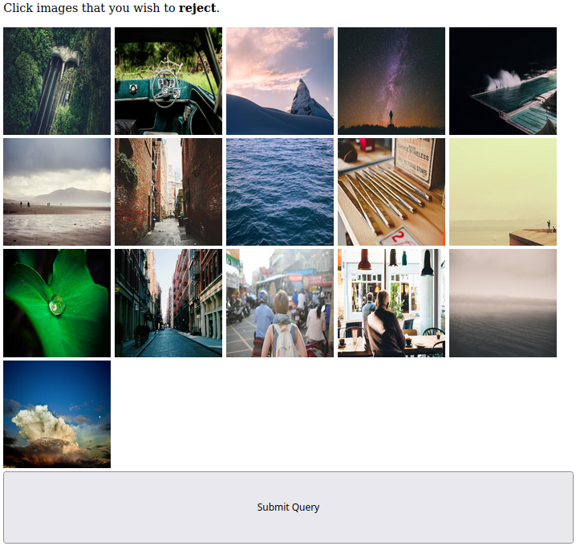

# Image Triaging Tool

A tool for triaging large numbers of images into two sets: "rejected" and "selected".

## Usecases

This application quickly sorts large collections of unlabelled images into two piles ("rejected" and "selected").

It is most useful for triaging large datasets of unlabeled images. It helps the user by displaying ~80 images in a grid so that the images may be sorted through quickly.

Touchscreen devices such as a tablet are recomended as it allows the user to select images more quickly than with a mouse.

## The Process

The application contains three empty directories:

 * `images_in/` - Images that must be triaged. **Place new unsorted images here.**
 * `images_selected/` - Images that meet the criteria (default selected).
 * `images_rejected/` - Images that do not meet the criteria and which were manually rejected by the user.

## Usage

 * Clone the repository and places unsorted images into the `images_in/` directory.
 * Install Ruby dependencies via `bundle install`.
 * Run the server via `ruby triage.rb`
 * visit `http://localhost:4567/`.
 * Click on any image(s) that must be rejected from the set.
 * Hit the submit button.
 * Continue the process until no images remain.

The server displays a grid of images and a submit button.
